# Hero FinCorp: Comprehensive Data-Driven Analysis


---

## Overview

Comprehensive data-driven analysis of Hero FinCorp's loan portfolio and customer behaviour, covering all **20 analysis tasks** from the assignment brief.

**Datasets:** 70,000 customers · 90,000 loans · 82,600 applications · 9,000 defaults · 50 branches · 495,000 transactions

---

## Key Findings

| Metric | Value |
|---|---|
| Total Disbursed | ₹226.46 Billion |
| Default Rate | **10.0%** |
| Recovery Rate | **24.3%** ⚠️ |
| Overdue Portfolio | **33.2%** of loans ⚠️ |
| Penalty Transactions | **50.1%** of all transactions ⚠️ |
| Avg Processing Time | **175 days** (target: 30 days) |
| Estimated Interest Income | ₹75.43 Billion |
| Approval Rate | 84.7% |

---

## Project Structure

```
hero_fincorp_analysis/
│
├── main.py                                  ← Entry point (runs all 20 tasks)
├── config.py                                ← Path configuration
├── requirements.txt
│
├── data/raw/                                ← 6 CSV datasets
│   ├── customers.csv
│   ├── loans.csv
│   ├── applications.csv
│   ├── defaults.csv
│   ├── branches.csv
│   └── transactions.csv
│
├── src/pgds/assignment/
│   ├── dataprocessor/
│   │   ├── data_loader.py                   ← Load all datasets
│   │   ├── data_cleaning.py                 ← Task 1: Clean & validate
│   │   ├── feature_engineering.py           ← Derived features
│   │   └── merge_data.py                    ← Master dataset merge
│   │
│   ├── analyser/                            ← One file per task
│   │   ├── descriptive_analysis.py          ← Task 2
│   │   ├── default_analysis.py              ← Task 3
│   │   ├── branch_analysis.py               ← Task 4
│   │   ├── customer_analysis.py             ← Task 5
│   │   ├── statistical_analysis.py          ← Task 6
│   │   ├── transaction_analysis.py          ← Task 7
│   │   ├── emi_analysis.py                  ← Task 8
│   │   ├── application_analysis.py          ← Task 9
│   │   ├── recovery_analysis.py             ← Task 10
│   │   ├── disbursement_analysis.py         ← Task 11
│   │   ├── profitability_analysis.py        ← Task 12
│   │   ├── geospatial_analysis.py           ← Task 13
│   │   ├── default_trends.py                ← Task 14
│   │   ├── branch_efficiency.py             ← Task 15
│   │   ├── time_series_analysis.py          ← Task 16
│   │   ├── customer_behavior.py             ← Task 17
│   │   ├── risk_analysis.py                 ← Task 18
│   │   ├── time_to_default.py               ← Task 19
│   │   └── transaction_pattern.py           ← Task 20
│   │
│   ├── visualizer/
│   │   └── plots.py                         ← All 37 charts
│   │
│   └── reporting/
│       └── report_generator.py              ← Word report (.docx)
│
└── reports/
    ├── hero_fincorp_analysis.docx           ← Full written report
    └── figures/                             ← 37 PNG charts
```

---

## All 20 Analysis Tasks

| # | Task | Module |
|---|---|---|
| 1 | Data Quality & Preparation | `dataprocessor/data_cleaning.py` |
| 2 | Descriptive Analysis | `analyser/descriptive_analysis.py` |
| 3 | Default Risk Analysis | `analyser/default_analysis.py` |
| 4 | Branch & Regional Performance | `analyser/branch_analysis.py` |
| 5 | Customer Segmentation | `analyser/customer_analysis.py` |
| 6 | Advanced Statistical Analysis | `analyser/statistical_analysis.py` |
| 7 | Transaction & Recovery Analysis | `analyser/transaction_analysis.py` |
| 8 | EMI Analysis | `analyser/emi_analysis.py` |
| 9 | Loan Application Insights | `analyser/application_analysis.py` |
| 10 | Recovery Effectiveness | `analyser/recovery_analysis.py` |
| 11 | Loan Disbursement Efficiency | `analyser/disbursement_analysis.py` |
| 12 | Profitability Analysis | `analyser/profitability_analysis.py` |
| 13 | Geospatial Analysis | `analyser/geospatial_analysis.py` |
| 14 | Default Trends | `analyser/default_trends.py` |
| 15 | Branch Efficiency | `analyser/branch_efficiency.py` |
| 16 | Time-Series Analysis | `analyser/time_series_analysis.py` |
| 17 | Customer Behavior Analysis | `analyser/customer_behavior.py` |
| 18 | Risk Assessment | `analyser/risk_analysis.py` |
| 19 | Time to Default Analysis | `analyser/time_to_default.py` |
| 20 | Transaction Pattern Analysis | `analyser/transaction_pattern.py` |

---

## How to Run

```bash
# 1. Clone the repository
git clone https://github.com/<YOUR-USERNAME>/hero-fincorp-analysis.git
cd hero-fincorp-analysis

# 2. Install dependencies
pip install -r requirements.txt

# 3. Run all 20 tasks
python main.py
```

All charts will be saved to `reports/figures/` and the Word report to `reports/hero_fincorp_analysis.docx`.

---

## Sample Visualizations

### Task 2 — Descriptive Analysis
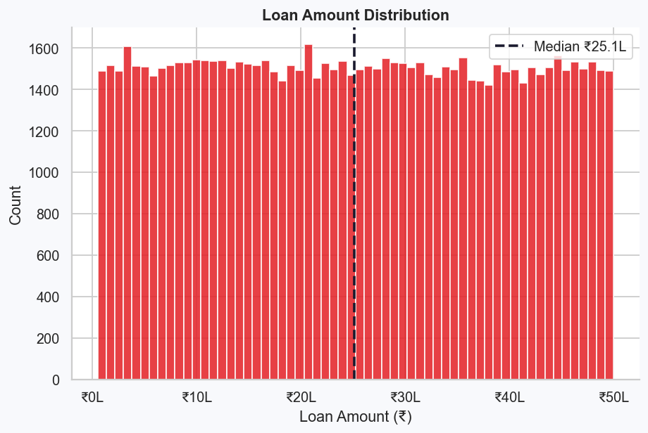
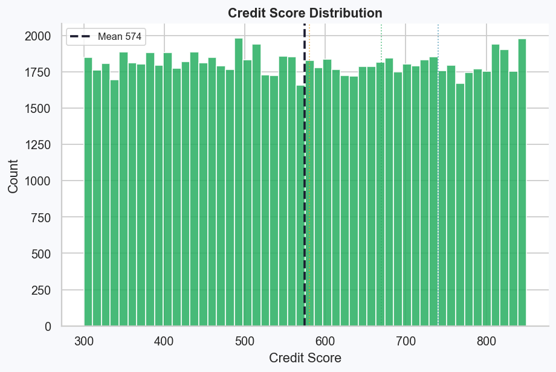
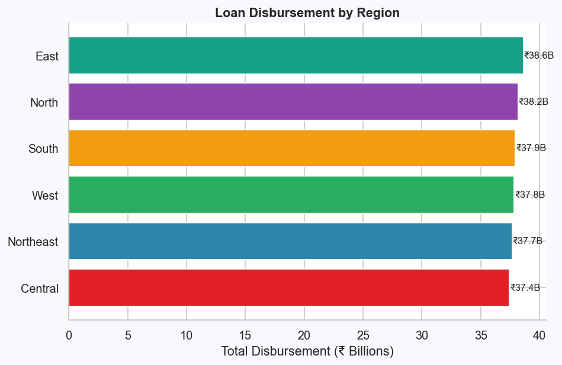

### Task 3 — Default Risk & Correlation
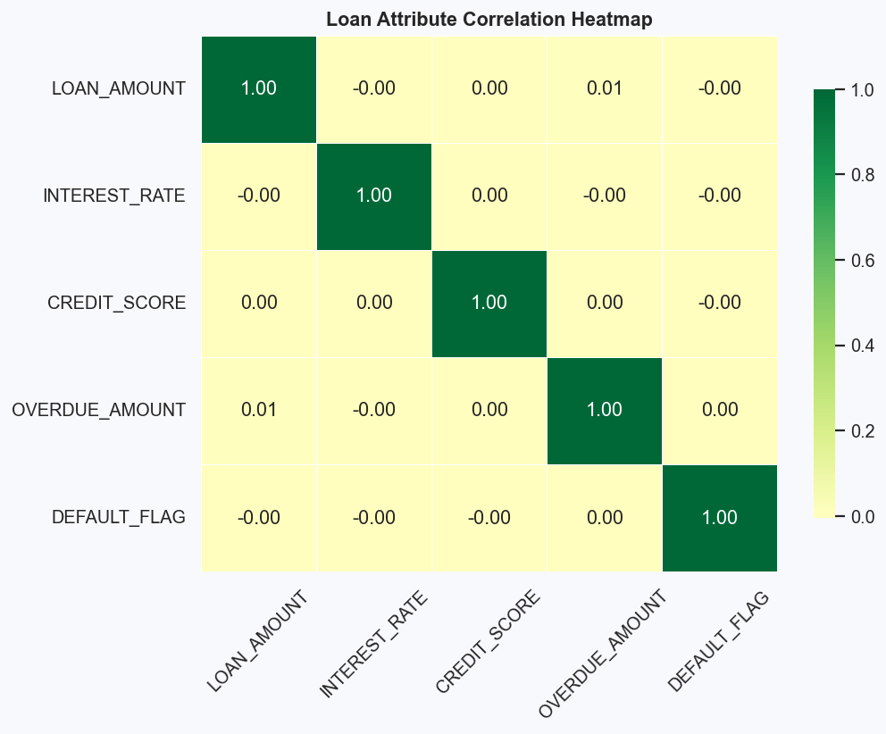
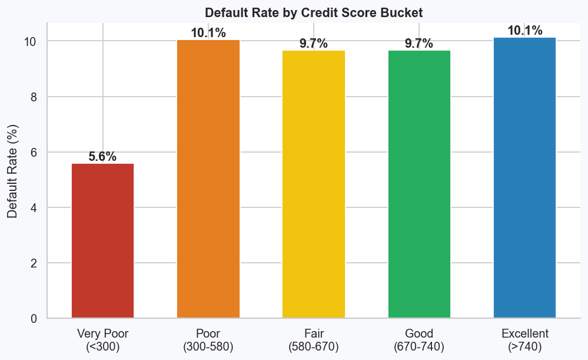

### Task 4 — Branch Performance
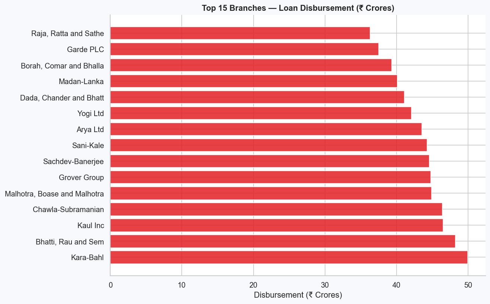
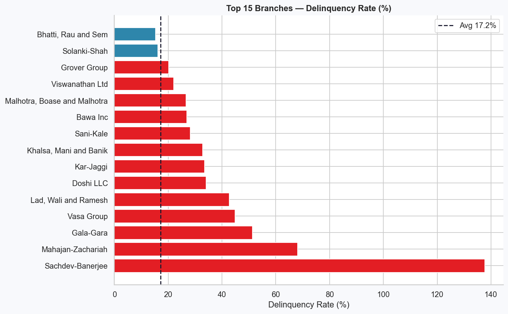

### Task 5 — Customer Segmentation
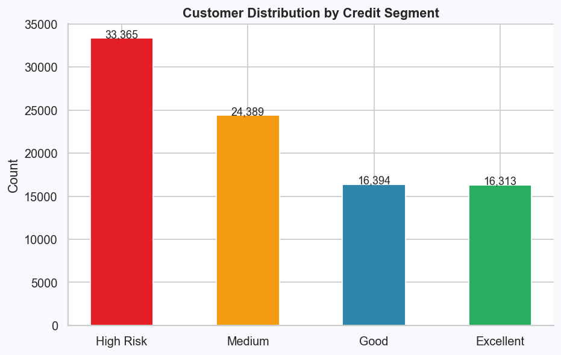
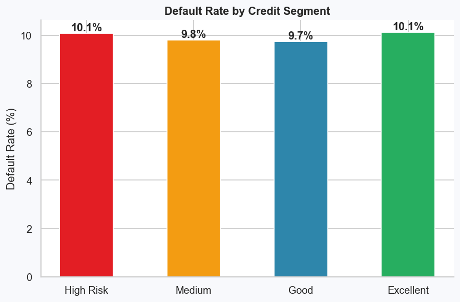

### Task 7 — Recovery Analysis
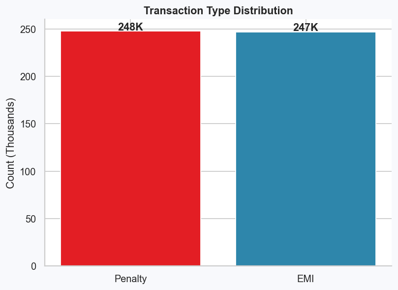
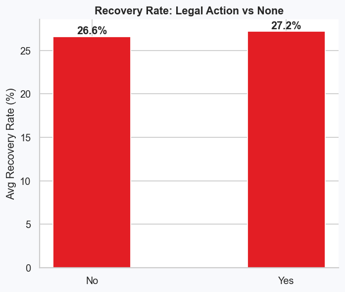

### Task 12 — Profitability
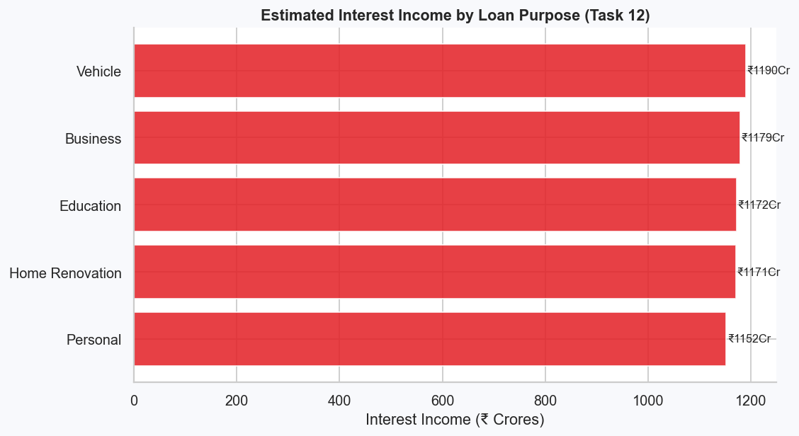
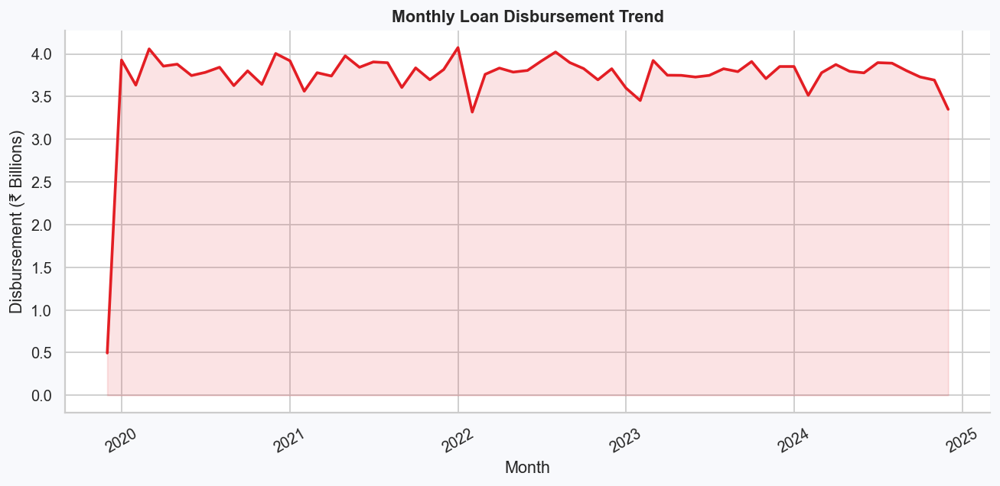

### Task 19 — Time to Default
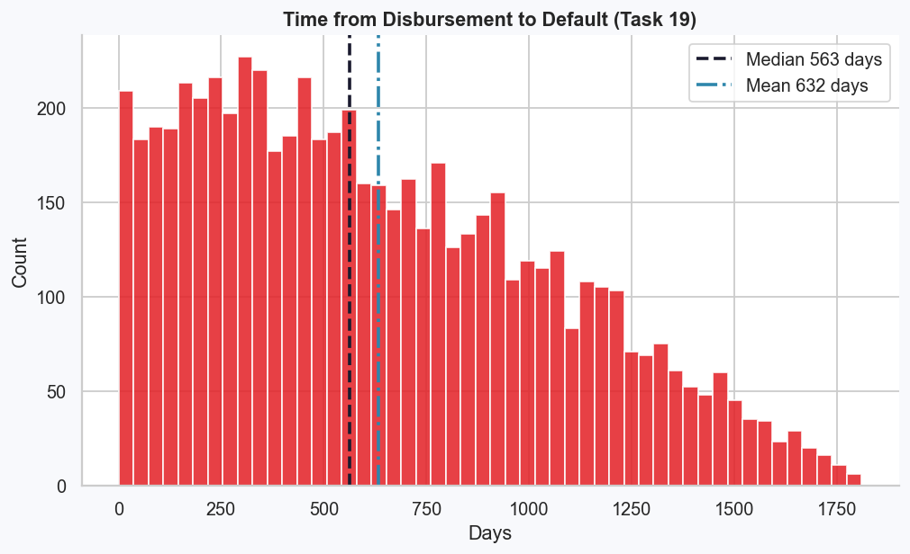

### Task 20 — Transaction Patterns
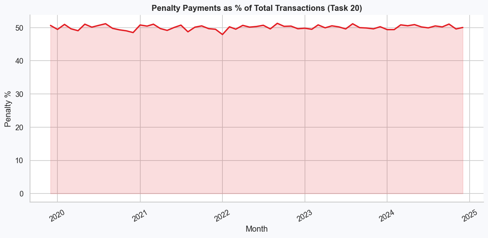

---

## Requirements

```
pandas>=1.5.0
numpy>=1.23.0
matplotlib>=3.6.0
seaborn>=0.12.0
scikit-learn>=1.1.0
scipy>=1.9.0
python-docx>=0.8.11
```

---

## Strategic Recommendations

1. **Reduce Defaults** — Enforce credit score minimum of 580 for unsecured loans; implement Early Warning System at months 3, 6, 12.
2. **Fix Recovery** — Current 24.3% recovery rate is critical. Partner with ARCs for NPAs >360 days; implement tiered collections.
3. **Speed Up Processing** — Reduce 175-day average to 30 days via digital document portals and automated credit API.
4. **Tackle Overdue Portfolio** — 33% overdue loans need immediate triage; offer EMI restructuring and grace periods.
5. **Boost Profitability** — Vehicle and Business loans are most profitable; convert 34% incomplete-document rejections via digital onboarding.

---

*Hero FinCorp Comprehensive Analysis — All 20 Tasks | April 2026*
